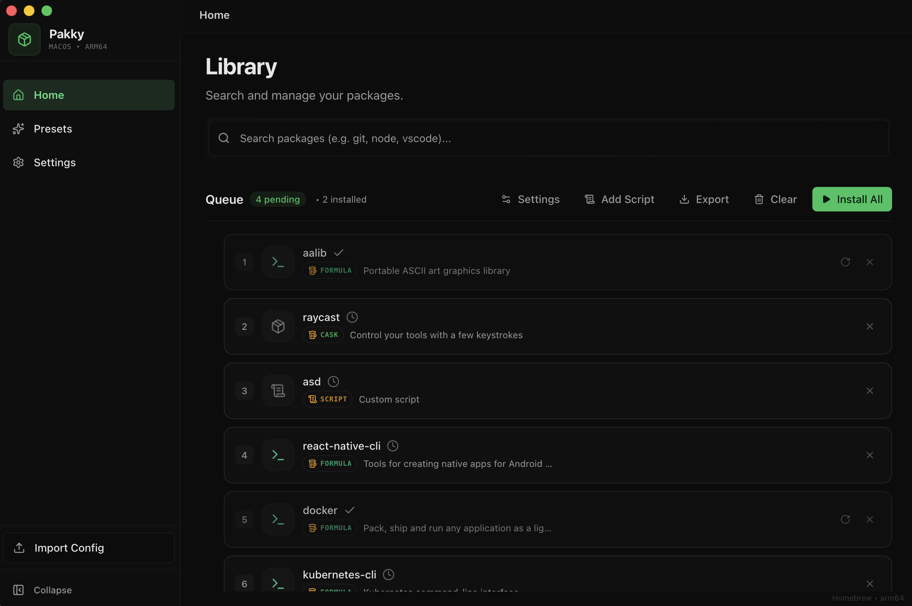

# Pakky

A cross-platform setup orchestrator that enables one-click installation of applications and configurations from shareable JSON configs.

[](LICENSE)
[](https://www.typescriptlang.org/)
[](https://www.electronjs.org/)
[](https://reactjs.org/)

## Features

- **One-Click Installation** - Install multiple applications from a single JSON config file
- **Shareable Configs** - Export and share your setup configurations with others
- **Preset Library** - Choose from pre-built presets for common development setups
- **Security Scanning** - Built-in command validation and bash script security analysis
- **Queue Management** - Drag-and-drop reordering, merge, and deduplicate packages
- **Progress Tracking** - Real-time installation progress with detailed status updates
- **Cross-Platform** - Built for macOS (primary), with Windows and Linux infrastructure ready

## Screenshots



## Installation

### Download

Download the latest release for your platform from the [Releases](https://github.com/zreik-blanc/Pakky/releases) page.

### macOS
- **DMG**: Mount and drag Pakky to Applications
- **ZIP**: Extract and move to Applications

### Windows
- **NSIS Installer**: Run the installer
- **Portable**: Extract and run directly

### Linux
- **AppImage**: Make executable and run
- **DEB**: Install via `dpkg -i pakky-*.deb`

## Usage

### Quick Start

1. Launch Pakky
2. Choose a preset from the built-in library, or import a `.pakky.json` config file
3. Review the packages to be installed
4. Click "Install All" and let Pakky handle the rest

### Configuration Format

Pakky uses JSON configuration files (`.pakky.json`) to define installations:

```json
{
  "name": "My Dev Setup",
  "description": "Essential tools for development",
  "version": "1.0.0",
  "packages": {
    "homebrew": ["git", "node", "python"],
    "cask": ["visual-studio-code", "docker", "iterm2"],
    "mas": []
  },
  "scripts": {
    "pre": [],
    "post": ["echo 'Setup complete!'"]
  }
}
```

### Supported Package Types (macOS)

| Type | Description | Example |
|------|-------------|---------|
| `homebrew` | Homebrew formulae | `git`, `node`, `python` |
| `cask` | Homebrew casks (GUI apps) | `visual-studio-code`, `docker` |
| `mas` | Mac App Store apps (by ID) | `497799835` (Xcode) |

## Development

### Prerequisites

- Node.js 18+
- npm 9+
- macOS (for full functionality)

### Setup

```bash
# Clone the repository
git clone https://github.com/zreik-blanc/Pakky.git
cd Pakky/pakky

# Install dependencies
npm install

# Start development server
npm run dev
```

### Commands

| Command | Description |
|---------|-------------|
| `npm run dev` | Start dev server with hot reload |
| `npm run build` | Build for current platform |
| `npm run build:mac` | Build macOS (DMG, ZIP) |
| `npm run build:win` | Build Windows (NSIS, Portable) |
| `npm run build:linux` | Build Linux (AppImage, DEB) |
| `npm run test` | Run tests |
| `npm run test:watch` | Run tests in watch mode |
| `npm run test:coverage` | Generate coverage report |
| `npm run lint` | Run ESLint |
| `npm run typecheck` | TypeScript type checking |

### Project Structure

```
Pakky/
├── pakky/                      # Electron application
│   ├── src/                    # React renderer (UI)
│   │   ├── components/         # React components
│   │   ├── hooks/              # Custom React hooks
│   │   ├── lib/                # Utilities and managers
│   │   └── stores/             # Zustand state stores
│   ├── electron/               # Electron main process
│   │   ├── ipc/                # IPC handlers
│   │   ├── installers/         # Platform-specific installers
│   │   └── utils/              # Utilities (security, logging)
│   ├── shared/                 # Shared TypeScript types
│   └── presets/                # Built-in preset configurations
└── .github/
    ├── CONTRIBUTING.md
    ├── SECURITY.md
    ├── CODE_OF_CONDUCT.md
    └── CHANGELOG.md
```

## Tech Stack

- **Framework**: [Electron](https://www.electronjs.org/) 39
- **Frontend**: [React](https://reactjs.org/) 18 + [TypeScript](https://www.typescriptlang.org/)
- **Build Tool**: [Vite](https://vitejs.dev/)
- **Styling**: [Tailwind CSS](https://tailwindcss.com/)
- **Components**: [Radix UI](https://www.radix-ui.com/)
- **Animations**: [Motion](https://motion.dev/)
- **State Management**: [Zustand](https://zustand-demo.pmnd.rs/)
- **Testing**: [Vitest](https://vitest.dev/)

## Security

Pakky takes security seriously:

- **Command Allowlist**: All shell commands are validated against a strict allowlist
- **Bash Script Scanning**: Scripts are parsed and analyzed for dangerous patterns
- **Security Levels**: Configs are assigned LOW/MEDIUM/HIGH risk levels with warnings
- **Context Isolation**: Renderer process has no direct Node.js access

See [SECURITY.md](.github/SECURITY.md) for details on reporting vulnerabilities.

## Contributing

We welcome contributions! Please see [CONTRIBUTING.md](.github/CONTRIBUTING.md) for guidelines.

## License

This project is licensed under the Apache License 2.0 - see the [LICENSE](LICENSE) file for details.

## Author

Created by [zreik-blanc](https://github.com/zreik-blanc)
