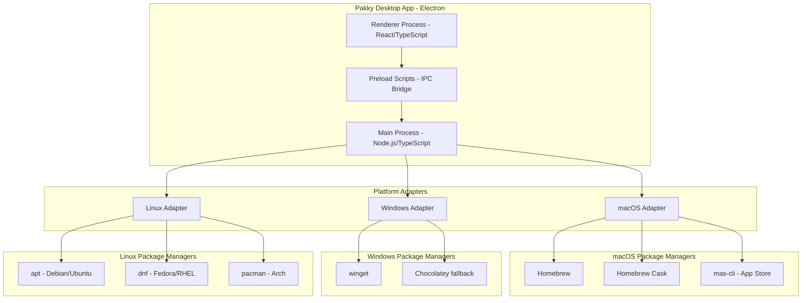

# Pakky - Cross-Platform Setup Orchestrator

A desktop application that enables one-click installation of applications, system configurations, and development environments from shareable JSON configuration files.

## Architecture Overview



## Technology Stack

| Component | Technology | Rationale |
|-----------|------------|-----------|
| **Desktop Framework** | **Electron** | All JavaScript/TypeScript, mature ecosystem, proven (VS Code, Slack, Discord) |
| **Frontend** | React + TypeScript + Vite | Modern, fast, great DX |
| **Styling** | Tailwind CSS | Rapid UI development |
| **Backend** | Node.js + TypeScript | Full system access, easy command execution |
| **Build Tool** | electron-builder | Cross-platform packaging, auto-updates |
| **State Management** | Zustand | Lightweight, simple |
| **Config Format** | JSON + JSON Schema | Human-readable, shareable, validatable |

---

## Potential Challenges & Solutions

### 1. Package Manager Naming Hell
**Problem**: Different package managers use different naming conventions:
- Homebrew: `visual-studio-code`
- winget: `Microsoft.VisualStudioCode`
- apt: `code`

**Solution**: Create a **package mapping layer** with a unified package ID system:
```json
{
  "id": "vscode",
  "displayName": "Visual Studio Code",
  "platforms": {
    "macos": { "homebrew_cask": "visual-studio-code" },
    "windows": { "winget": "Microsoft.VisualStudioCode" },
    "linux": { "apt": "code", "snap": "code" }
  }
}
```

### 2. Permissions & Security
**Problem**: 
- macOS sandboxing blocks shell command execution
- Notarization required for distribution
- Admin privileges needed for package managers

**Solution**:
- Build as **unsigned app** for development, sign for release
- Use `sudo` prompts where needed (Homebrew doesn't need sudo)
- Request permissions via Electron's `systemPreferences` API
- Document notarization process for macOS distribution

### 3. Idempotency (Don't Reinstall Already Installed)
**Problem**: Running the same config twice shouldn't reinstall everything.

**Solution**: **Pre-scan installed packages** before installation:
```typescript
// macOS example
async function getInstalledBrewPackages(): Promise<string[]> {
  const { stdout } = await exec('brew list --formula');
  return stdout.trim().split('\n');
}

async function getInstalledCasks(): Promise<string[]> {
  const { stdout } = await exec('brew list --cask');
  return stdout.trim().split('\n');
}
```
- Compare requested packages against installed list
- Show "Already installed" status in UI
- Option to "Force reinstall" if needed

### 4. Failure Recovery (Partial Success)
**Problem**: If package 5/20 fails, users want partial success, not all-or-nothing.

**Solution**:
- **Individual package status tracking**: pending → installing → success/failed/skipped
- **Continue on error** by default (configurable)
- **Retry failed** button in UI
- **Installation log** with full command output per package
- **Summary report** at end showing successes/failures

```typescript
interface PackageInstallResult {
  packageId: string;
  status: 'success' | 'failed' | 'skipped' | 'already_installed';
  duration: number;
  error?: string;
  logs: string[];
}
```

---

## User Input & Environment Storage

When the config contains `prompt_for_input` fields, the app will:

1. **Show a UI form** asking for the values (Git username, email, etc.)
2. **Save values to `.pakky.env`** in the user's home directory
3. **Template values into commands** using `{{variable}}` syntax
4. **Reuse values** for future installs (no re-prompting)

### Example Flow
```
Config has: prompt_for_input.user.email
                ↓
App shows: "Enter your Git email: [________________]"
                ↓
User enters: efee@example.com
                ↓
Saved to: ~/.pakky.env → USER_EMAIL=efee@example.com
                ↓
Command: git config --global user.email '{{user.email}}'
Becomes: git config --global user.email 'efee@example.com'
```

### Benefits
- **Privacy**: Sensitive data stays local, never in shareable JSON configs
- **Reusable**: Same values available for future installs/updates
- **Multiple apps**: Git, npm, SSH, etc. all use the same collected values
- **Onboarding**: First-run wizard collects everything upfront

---

## Additional Features (Post-MVP)

### Dry-Run Mode
Show what would be installed without actually doing it:
- List all packages with their install commands
- Highlight what's already installed vs. what's new
- Export preview as markdown for review

### Rollback/Uninstall
Reverse a configuration:
- Track what was installed by Pakky in a local manifest
- Generate uninstall commands from manifest
- Warning: Can't rollback system setting changes easily

### Dependency Resolution
Some packages require others:
- nvm needs specific shell configuration
- Docker Desktop needs virtualization enabled
- Build order for dependent packages

### Config Diff
Compare two JSON configs:
- Show added/removed/changed packages
- Useful for "What changed since last setup?"

### Community Presets Library
- GitHub repo of curated presets
- Categories: Web Dev, iOS Dev, Data Science, DevOps, etc.
- User submissions with quality review

---

## Project Structure

```
Pakky/
├── electron/                     # Electron main process (Node.js)
│   ├── main.ts                   # Entry point, window management
│   ├── preload.ts                # Preload script (IPC bridge)
│   ├── ipc/                      # IPC handlers
│   │   ├── index.ts
│   │   ├── install.ts            # Installation handlers
│   │   ├── config.ts             # Config load/save handlers
│   │   └── system.ts             # System info handlers
│   ├── installers/               # Platform-specific installers
│   │   ├── index.ts
│   │   ├── macos.ts              # brew, cask, mas
│   │   ├── windows.ts            # winget, chocolatey
│   │   └── linux.ts              # apt, dnf, pacman
│   ├── config/                   # Configuration management
│   │   ├── schema.ts             # JSON schema validation
│   │   └── loader.ts             # Load/save configs
│   └── utils/
│       ├── shell.ts              # Command execution
│       └── platform.ts           # OS detection
│
├── src/                          # React frontend (renderer process)
│   ├── components/
│   │   ├── ui/                   # Shared UI components
│   │   │   ├── Button.tsx
│   │   │   ├── Card.tsx
│   │   │   ├── Progress.tsx
│   │   │   └── Modal.tsx
│   │   ├── PackageList.tsx       # Package selection list
│   │   ├── CategoryTabs.tsx      # Package categories
│   │   ├── InstallProgress.tsx   # Installation progress view
│   │   ├── ConfigImport.tsx      # Import JSON config
│   │   └── ConfigExport.tsx      # Export JSON config
│   ├── pages/
│   │   ├── Home.tsx              # Main package selection
│   │   ├── Install.tsx           # Installation progress
│   │   ├── Settings.tsx          # App settings
│   │   └── Presets.tsx           # Pre-made configs
│   ├── stores/
│   │   ├── packageStore.ts       # Selected packages state
│   │   └── installStore.ts       # Installation state
│   ├── hooks/
│   │   ├── useInstaller.ts       # Installation hook
│   │   └── usePlatform.ts        # Platform detection
│   ├── lib/
│   │   ├── electron.ts           # Electron IPC wrappers
│   │   └── types.ts              # TypeScript types
│   ├── App.tsx
│   ├── main.tsx
│   └── index.css
│
├── presets/                      # Pre-made configuration files
│   ├── web-developer.json
│   ├── data-scientist.json
│   ├── designer.json
│   └── minimal.json
│
├── electron-builder.yml          # Build configuration
├── package.json
├── vite.config.ts
├── tailwind.config.js
├── tsconfig.json
├── tsconfig.node.json
└── README.md
```

---

## Configuration Schema

### Example Configuration File

```json
{
  "$schema": "./pakky-config.schema.json",
  "name": "My Development Setup",
  "version": "1.0.0",
  "author": "efee",
  "description": "My personal development environment setup",
  
  "macos": {
    "homebrew": {
      "formulae": ["git", "node", "python", "ripgrep", "fzf", "gh"],
      "casks": ["visual-studio-code", "docker", "iterm2", "raycast", "arc"]
    },
    "mas": [
      { "id": 497799835, "name": "Xcode" },
      { "id": 1451685025, "name": "WireGuard" }
    ],
    "shell": {
      "install_oh_my_zsh": true,
      "zsh_plugins": ["zsh-autosuggestions", "zsh-syntax-highlighting"]
    },
    "system": {
      "dock_autohide": true,
      "show_hidden_files": true,
      "key_repeat_rate": 2
    }
  },
  
  "windows": {
    "winget": ["Git.Git", "Microsoft.VisualStudioCode", "Docker.DockerDesktop"],
    "chocolatey": ["nvm", "python3"]
  },
  
  "linux": {
    "apt": ["git", "curl", "build-essential", "docker.io"],
    "dnf": ["git", "curl", "docker"],
    "pacman": ["git", "docker", "base-devel"],
    "shell": {
      "install_oh_my_zsh": true
    }
  },
  
  "post_install": [
    {
      "name": "Configure Git",
      "commands": [
        "git config --global user.name 'Your Name'",
        "git config --global user.email 'you@example.com'"
      ]
    }
  ]
}
```

---

## Platform Support Matrix

| Feature | macOS | Windows | Linux |
|---------|-------|---------|-------|
| **CLI Tools** | Homebrew | winget | apt/dnf/pacman |
| **GUI Apps** | Homebrew Cask | winget | apt/dnf/pacman + Flatpak |
| **App Store** | mas-cli ✅ | Microsoft Store (via winget) | N/A |
| **Shell Config** | oh-my-zsh, themes | PowerShell profile | oh-my-zsh, themes |
| **System Settings** | `defaults` command | Registry/PowerShell | gsettings/dconf |

---

## Development Phases (Refined)

### Phase 1: MVP (macOS Only) ⭐ CURRENT FOCUS
**Goal**: A polished single-platform tool that works perfectly.

- [ ] Electron + React + Vite project setup
- [ ] Platform detection
- [ ] **macOS Homebrew installer**
  - [ ] Check if Homebrew is installed, offer to install it
  - [ ] Get list of installed formulae/casks (idempotency)
  - [ ] Install formulae with real-time log streaming
  - [ ] Install casks with real-time log streaming
- [ ] **Beautiful progress UI**
  - [ ] Package cards with status indicators
  - [ ] Real-time terminal-style log output
  - [ ] Success/failure summary
- [ ] **JSON config import/export**
  - [ ] Load config from file
  - [ ] Save current selection to config
  - [ ] Validate config against schema
- [ ] **One killer preset**: `web-developer.json`

### Phase 2: Full macOS Support
- [ ] mas-cli (App Store) support
- [ ] Shell configuration (oh-my-zsh)
- [ ] macOS system settings via `defaults`
- [ ] Dry-run mode
- [ ] Retry failed packages

### Phase 3: Cross-Platform
- [ ] Windows support (winget + Chocolatey)
- [ ] Linux support (apt + dnf + pacman detection)
- [ ] Cross-platform shell configs

### Phase 4: Polish & Community
- [ ] More preset configurations
- [ ] Community preset library (GitHub integration?)
- [ ] Config diff tool
- [ ] Rollback functionality
- [ ] Auto-updater integration
- [ ] App notarization for macOS distribution

---

## Verification Plan

### Automated Tests
- Unit tests for config validation with Jest
- Integration tests for installer commands (mock mode)
- E2E tests with Playwright for UI flows

### Manual Verification
- Test Homebrew installation on fresh macOS VM
- Test with packages that are already installed (idempotency)
- Test failure scenarios (invalid package names)
- Test config import/export cycle
